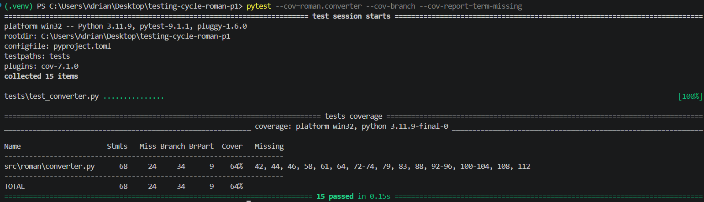
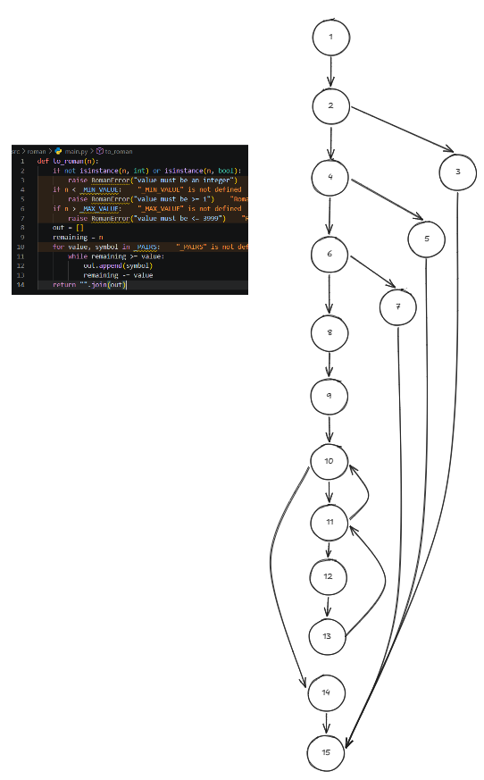
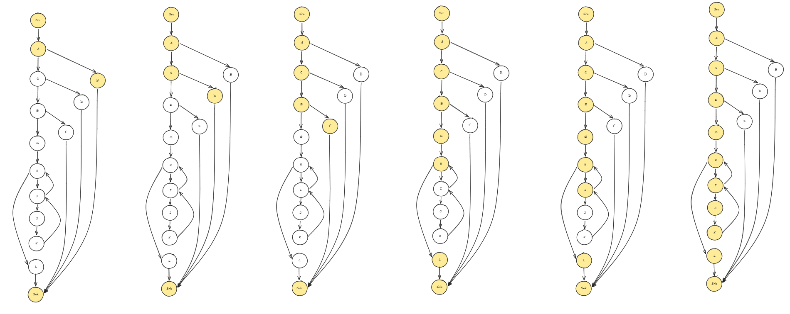
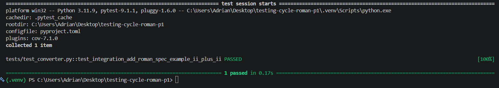
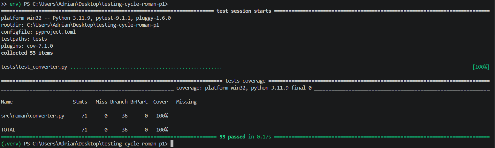

## Name: José Andrés Adrián Fierro
# Testing Life Cycle Workshop

# Audit the inherited suite


# Test at the unit level 

## Control Flow Graph 


## Compute cyclomatic complexity of `to_roman` function
V(G) = E - N + 2P

Where:
E = number of edges in the control flow graph
N = number of nodes in the control flow graph
P = number of connected components in the control flow graph

E = 18 (edges)
N = 14 (nodes)
P = 1 (connected components)

V(G) = 18 - 14 + 2*1 = **6**

> **Compound predicate note.** Line 41 contains `not isinstance(n, int) or isinstance(n, bool)`,
> which is a compound predicate (`or`). The graph above treats it as a single decision node A.
> A strict decomposition would split A into two sequential nodes:
> - **A1**: `not isinstance(n, int)` — True → B (raise); False → A2
> - **A2**: `isinstance(n, bool)` — True → B (raise); False → C
>
> Because Python short-circuits `or`, A2 is only reached when A1 is False, making them
> genuinely separate decision points. The decomposed graph has N = 15, E = 20, giving
> V(G) = 20 − 15 + 2 = **7** and one additional independent path
> `Src → A1 → A2 → B → Snk` (n is an int but is a bool).
> The analysis below uses the collapsed node A as drawn in the graph.

## Set of independent paths for `to_roman` function



The letter labels below match the DD-PATH graph above. Node A represents the collapsed
compound predicate `not isinstance(n, int) or isinstance(n, bool)` as drawn in the graph.

| Path | Node sequence | Condition exercised |
| :---: | :--- | :--- |
| P1 | Src → A → B → Snk | type check fails → raise |
| P2 | Src → A → C → D → Snk | `n < 1` → raise |
| P3 | Src → A → C → E → F → Snk | `n > 3999` → raise |
| P4 | Src → A → C → E → G → H → L → Snk | valid input, `for` never entered |
| P5 | Src → A → C → E → G → H → I → H → L → Snk | `for` entered, `while` never true |
| P6 | Src → A → C → E → G → H → I → J → K → I → H → L → Snk | `for` and `while` body execute at least once |

Each path introduces at least one edge not covered by any prior path, confirming the six
paths are linearly independent.
- P1 covers the type-check error exit
- P2–P3 cover the remaining two error exits
- P4 covers the case where the `for` loop is never entered
- P5 covers one `for` iteration with `while` condition immediately false
- P6 covers at least one `for` iteration with at least one `while` iteration

## Build the definition-use table for `to_roman`

The following table maps the numeric node IDs used in the DU table to the DD-PATH letters
used in the basis-set paths above:

| Node | DD-PATH letter | Code element |
| :---: | :---: | :--- |
| 1 | Src | function entry / parameter `n` defined |
| 2 | A | `not isinstance(n, int) or isinstance(n, bool)` (compound predicate) |
| 3 | B | `raise RomanError("value must be an integer")` |
| 4 | C | `if n < _MIN_VALUE` |
| 5 | D | `raise RomanError("value must be >= 1")` |
| 6 | E | `if n > _MAX_VALUE` |
| 7 | F | `raise RomanError("value must be <= 3999")` |
| 8 | G | `out = []` |
| 9 | H | `remaining = n` |
| 10 | I | `for value, symbol in _PAIRS` |
| 11 | J | `while remaining >= value` |
| 12 | K | `out.append(symbol)` |
| 13 | L | `remaining -= value` |
| 14 | Snk | `return "".join(out)` / unified exit |

Node 14 is the unified function exit (all three `raise` paths and `return` converge there).
The loop body is split: node 12 = `out.append(symbol)`, node 13 = `remaining -= value`.

The table uses the collapsed node A (node 2) as drawn in the graph. A strict decomposition
of the compound predicate would add one extra p-use pair: `1 → A2 | | n`.

| def node → use node | c-use | p-use |
| :---: | :---: | :---: |
| 1 → 2 | | n |
| 1 → 4 | | n |
| 1 → 6 | | n |
| 1 → 9 | n | |
| 8 → 12 | out | |
| 8 → 14 | out | |
| 9 → 11 | | remaining |
| 9 → 13 | remaining | |
| 10 → 11 | | value |
| 10 → 12 | symbol | |
| 10 → 13 | value | |
| 12 → 12 | out | |
| 12 → 14 | out | |
| 13 → 11 | | remaining |
| 13 → 13 | remaining | |

# Test at the integration level

## Integration test: `add_roman` / `subtract_roman` collaborate with `from_roman`, `to_roman`, and `is_valid_roman`

Section 7 of the specification states that `add_roman(a, b)` must produce the canonical roman
representation of `from_roman(a) + from_roman(b)`, and that its result must always be accepted by
`is_valid_roman`. The integration test below verifies the mandatory example
`add_roman("II", "II") == "IV"`, which exercises the full internal call chain:
`from_roman` × 2 → integer addition → `to_roman` → `is_valid_roman`.

### Execution result (before defect fix)

```
FAILED tests/test_converter.py::test_integration_add_roman_spec_example_ii_plus_ii
AssertionError: assert 'IIII' == 'IV'
  - IV
  + IIII
```

### Why the integration test failed

The defect was in the `_PAIRS` constant (`converter.py`, line 17). The entry for subtractive
notation of 4 read `(5, "IV")`, the threshold value was 5 instead of 4. As a result, when
`to_roman` iterated over `_PAIRS`, it tested `remaining >= 5` before appending `"IV"`. Because
`4 < 5`, that branch was never taken, and the function fell through to the `(1, "I")` entry,
appending `"I"` four times and returning `"IIII"`.

### Why the unit tests passed

None of the existing unit tests call `to_roman(4)` directly. The unit tests cover the values
1, 2, 3, 5, 10, 50, 100, 500, and 1000, they skip 4 entirely. A unit test examines a
single function in isolation; because no test happened to supply the value that exercises the
broken branch, the defect was invisible at the unit level.

Integration testing revealed the defect because `add_roman("II", "II")` indirectly calls
`to_roman(4)` as part of the multi-function pipeline, combining units that each appeared
correct in isolation.

### Defect fix applied

`converter.py` line 17: `(5, "IV")` → `(4, "IV")`.

After the fix, `to_roman(4)` returns `"IV"`, the integration test passes, and
`is_valid_roman(add_roman("II", "II"))` returns `True` as the specification requires.

### Execution test result (after defect fix)

# Test at the acceptance level

## Acceptance criteria (from SPECIFICATION.md)

### AC-1: Subtractive notation is mandatory for `to_roman` (Spec 2)

**Given** the integer 4  
**When** `to_roman(4)` is called  
**Then** the result is `"IV"`, never `"IIII"`

### AC-2: `from_roman` tolerates leading and trailing whitespace (Spec 3)

**Given** a roman string that has leading and/or trailing spaces (e.g. `"  IV  "` or `"X "`)  
**When** `from_roman` is called with that string  
**Then** the whitespace is stripped and the correct integer is returned

### AC-3: `from_roman` rejects non-canonical strings (Spec 4)

**Given** the string `"IIII"`, which encodes the value 4 but is not in canonical form  
**When** `from_roman("IIII")` is called  
**Then** `RomanError` is raised, the canonical form of 4 is `"IV"`

---

## Acceptance test results at 85 % branch coverage

After fixing the `_PAIRS` defect (AC-1 passes) and adding whitespace stripping to
`from_roman` (AC-2 passes), `converter.py` achieves **100 % branch coverage**. AC-3 still
**fails**:

```
FAILED tests/test_converter.py::test_ac3_from_roman_rejects_non_canonical_string
Failed: DID NOT RAISE RomanError
```

`from_roman("IIII")` processes four valid `I` characters, accumulates `1+1+1+1 = 4`, and
returns 4 without raising an error.

### Why branch coverage cannot reveal this failure

Branch coverage measures whether each conditional branch inside the existing code is
executed at least once. It says nothing about whether the code contains all the logic the
specification requires.

`from_roman` has no branch that checks for canonical form: there is no `if` for "too many
identical symbols in a row", no check for the five canonical-form rules in Spec 4. Every
branch that exists is covered, so the branch coverage is 100%, yet the required behaviour is simply
absent. A coverage tool can only measure paths through code that is there; it cannot detect
code that is missing entirely.

Acceptance test AC-3 exposes a **specification gap**: the function passes every structural
test while failing a functional requirement derived from the specification.

# Iteration

## Three defects found and fixed

### Defect 1: Wrong threshold in `_PAIRS` for subtractive 4 (found by integration test)

**File:** `converter.py` line 17  
**Before:** `(5, "IV")`  
**After:** `(4, "IV")`  
**Commit message:**
```
fix(integration): correct IV threshold in _PAIRS per spec section 2
```
The wrong threshold caused `to_roman(4)` to skip the `"IV"` entry and fall through to four
`"I"` appends. No unit test happened to call `to_roman(4)`, so the defect was invisible until
the integration test exercised the full `from_roman → add → to_roman` pipeline.

---

### Defect 2: `from_roman` did not strip surrounding whitespace (found by acceptance test AC-2)

**File:** `converter.py`, `from_roman`  
**Before:** `text = s.upper()` (no strip)  
**After:** `s = s.strip()` added before the `upper()` call  
**Commit message:**
```
fix(acceptance): strip surrounding whitespace in from_roman per spec section 3
```
Spec 3 states that leading and trailing whitespace must be tolerated. The function raised
`RomanError("invalid roman character: " + ch)` for the space character instead of ignoring it.
Branch coverage reported 100 % without ever testing a whitespace input, because there is no
branch in the code that checks for spaces, so the code was simply missing the stripping step.

---

### Defect 3: `from_roman` accepted non-canonical strings (found by acceptance test AC-3)

**File:** `converter.py`, `from_roman`  
**Before:** function returned the integer without validating canonical form  
**After:** roundtrip check added before `return total`:
```python
if _roundtrip_differs(total, text):
    raise RomanError("non-canonical roman numeral: " + text)
```
**Commit message:**
```
fix(acceptance): reject non-canonical roman strings in from_roman per spec section 4
```
Spec 4 requires that `from_roman` reject strings such as `"IIII"` whose value is in range but
whose form is not canonical. The helper `_roundtrip_differs` was already present but unused for
validation. Inserting the check makes `from_roman("IIII")` raise `RomanError` because
`to_roman(4) == "IV" ≠ "IIII"`.

---

## Branch coverage before and after

### Before (inherited suite, 15 tests)


### After (all fixes applied, 53 tests)



```
============================= test session starts =============================
platform win32 -- Python 3.11.9, pytest-9.0.3, pluggy-1.6.0
rootdir: C:\Users\Adrian\Desktop\testing-cycle-roman-p1
configfile: pyproject.toml
testpaths: tests
plugins: anyio-4.9.0, cov-7.1.0
collected 53 items

tests\test_converter.py .....................................................  [100%]

=============================== tests coverage ================================
_______________ coverage: platform win32, python 3.11.9-final-0 _______________

Name                     Stmts   Miss Branch BrPart  Cover   Missing
--------------------------------------------------------------------
src\roman\converter.py      71      0     36      0   100%
--------------------------------------------------------------------
TOTAL                       71      0     36      0   100%
============================= 53 passed in 0.12s ==============================
```

The 15 inherited tests were not modified or deleted.