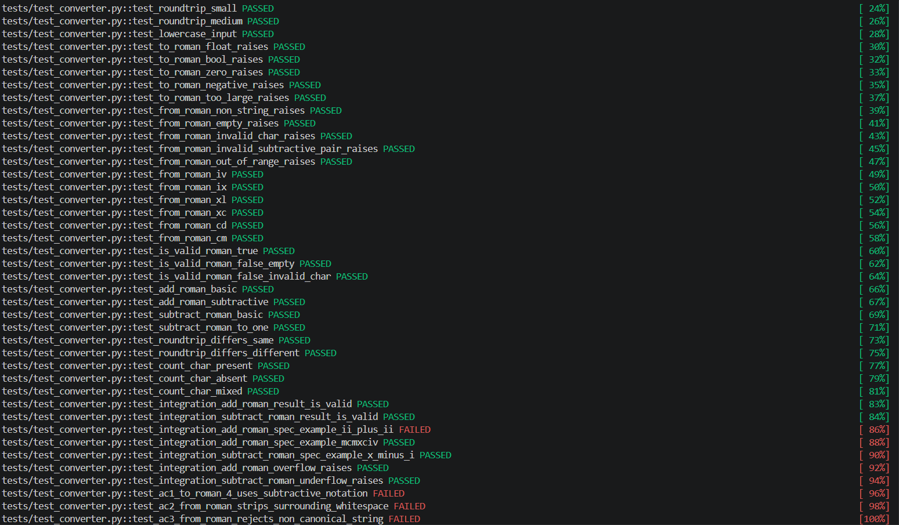

## Name: José Andrés Adrián Fierro
# Testing Life Cycle Workshop

# Audit the inherited suite

# Test at the unit level 

## Control Flow Graph 

## Compute cyclomatic complexity of `to_roman` function
V(G) = E - N + 2P

Where:
E = number of edges in the control flow graph
N = number of nodes in the control flow graph
P = number of connected components in the control flow graph

E = 18 (edges)
N = 14 (nodes)
P = 1 (connected components)

V(G) = 18 - 14 + 2*1 = 6

## Set of independent paths for `to_roman` function

## Build the definition use of to_romman function

| definition - use pair | variable(s) | |
| start line -> end line | c-use | p-use |
| :---: | :---: | :---: |
| 1 -> 2 | | n |
| 1 -> 4 | | n |
| 1 -> 6 | | n |
| 1 -> 9 | n | |
| 8 -> 12 | out | |
| 8 -> 14 | out | |
| 9 -> 11 | | remaining |
| 9 -> 13 | remaining | |
| 10 -> 11 | | value |
| 10 -> 12 | symbol | |
| 10 -> 13 | value | |
| 12 -> 12 | out |  |
| 12 -> 14 | out | |
| 13 -> 11 | | remaining |
| 13 -> 13 | remaining | |

# Test at the integration level

